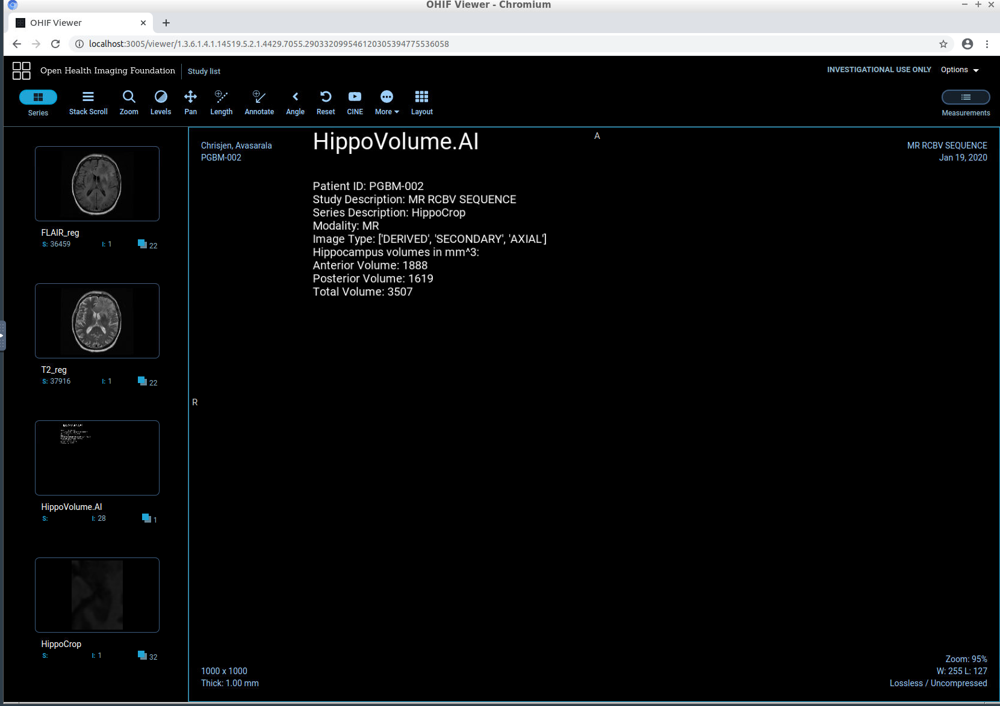

# Hippocampal Volume Segmentation for Alzheimer's Disease detection

## Quantifying Alzheimer's Disease Progression Through Automated Measurement of Hippocampal Volume

Alzheimer's disease (AD) is a progressive neurodegenerative disorder that results in impaired neuronal (brain cell) function and eventually, cell death. AD is the most common cause of dementia. Clinically, it is characterized by memory loss, inability to learn new material, loss of language function, and other manifestations. 

For patients exhibiting early symptoms, quantifying disease progression over time can help direct therapy and disease management. 

A radiological study via MRI exam is currently one of the most advanced methods to quantify the disease. In particular, the measurement of hippocampal volume has proven useful to diagnose and track progression in several brain disorders, most notably in AD. Studies have shown reduced volume of the hippocampus in patients with AD.

The hippocampus is a critical structure of the human brain (and the brain of other vertebrates) that plays important roles in the consolidation of information from short-term memory to long-term memory. In other words, the hippocampus is thought to be responsible for memory and learning (that's why we are all here, after all!). Here is a GIF with highlighted left and right hippocampus:

Humans have two hippocampi, one in each hemishpere of the brain. They are located in the medial temporal lobe of the brain. The word "hippocampus" is roughly translated from Greek as "horselike" because of the similarity to a seahorse, a peculiarity observed by one of the first anatomists to illustrate the structure.

According to [studies](https://www.sciencedirect.com/science/article/pii/S2213158219302542), the volume of the hippocampus varies in a population, depending on various parameters, within certain boundaries, and it is possible to identify a "normal" range when taking into account age, sex and brain hemisphere. 

There is one problem with measuring the volume of the hippocampus using MRI scans, though - namely, the process tends to be quite tedious since every slice of the 3D volume needs to be analyzed, and the shape of the structure needs to be traced. The fact that the hippocampus has a non-uniform shape only makes it more challenging. Do you think you could spot the hippocampi in this axial slice?

The goal is to build a piece of AI software that could help clinicians perform this task faster and more consistently.

## Repository description

We build an end-to-end AI system which features a machine learning algorithm (U-Net) that can be integrated into a clinical-grade viewer and automatically measures hippocampal volumes of new patients, as their studies are committed to the clinical imaging archive.

It is assumed that the patients brain scans are already cropped to a rectangular cube containing the hippocampus. This can be interpreted as if (fictional) radiology department runs a 'HippoCrop' tool which cuts out a rectangular portion of a brain scan from every image series and our committed radiologists have collected and annotated a dataset of relevant volumes, and converted them to NIFTI format.

We use the dataset that contains the segmentations of the right hippocampus and the U-Net architecture to build a segmentation model.

After that, we integrate the model into a working clinical PACS such that it runs on every incoming study and produces a report with volume measurements. For this task we need a working pipeline consisting of several software packages like Orthanc server, OHIF viewer, and so on. A detailed description is given is the subdirectory section3/.

## The Dataset

We are using the "Hippocampus" dataset from the [Medical Decathlon competition](http://medicaldecathlon.com/). This dataset is stored as a collection of NIFTI files, with one file per volume, and one file per corresponding segmentation mask. The original images here are T2 MRI scans of the full brain. As noted, in this dataset we are using cropped volumes where only the region around the hippocampus has been cut out. This makes the size of our dataset quite a bit smaller, our machine learning problem a bit simpler and allows us to have reasonable training times. This is not a "toy" problem, though. Algorithms that crop rectangular regions of interest are quite common in medical imaging. Segmentation is still hard.

## The Programming Environment

Recommended is a Python 3.7+ environment with the following libraries for the first two sections (see section1/ and section2/) of the project:

* nibabel
* matplotlib
* numpy
* pydicom
* PIL
* json
* torch (preferably with CUDA)
* tensorboard

For section 3 see sub-directory section3/ for more details.

## Project Instructions

### Section 1: Curating a dataset of Brain MRIs

In the project directory called `section1` we will perform an exploratory data analysis (see file eda.ipynb). The goal is to inspect the dataset, understand the clinical side of the problem and get it ready for consumption by the ML algorithm in `section2`.

The following figure shows a sample image of a right hippocampus with overlayed segmentation:

### Section 2: Training a segmentation CNN

The directory called `section2/src` contains the source code that forms the framework for your machine learning pipeline.

We use [PyTorch](https://pytorch.org/) to train the model and we use [Tensorboard](https://www.tensorflow.org/tensorboard/) to visualize the results.

With the script `run_ml_pipeline.py` (or `run_ml_pipeline.ipynb`) we kick off the training pipeline. 

The code has hooks to log progress to Tensorboard. In order to see the Tensorboard output launch Tensorboard executable from the same directory where `run_ml_pipeline.py` is located using the following command:

> `tensorboard --logdir runs --bind_all`

After that, Tensorboard will write logs into directory called `runs` and you will be able to view progress by opening the browser and navigating to default port 6006 of the machine where you are running it.

The following figure shows the tracking of the loss function during training of the ML model:

### Section 3: Integrating into a clinical network

In `section3` we apply the results of the hippocampal segmentation algorithm in a clinical application simulation.
A more detailed explanation is given directly in the `section3` sub-directory.

Here we just want to display some prediction results of the U-Net CNN algorithm. 

 

## Project summary in form of a validation plan
In the following we provide a summary of the project at hand in form of a validation plan. A validation plan is essential for medical products that are looking for an approvement by the FDA. A clinical validation is all about proving that the technology performs the way you claim it does:

****Name of Device:**** HippoVolume.AI

### Intended Use

We propose an AI system that helps radiologists and other physicians to measure the hippocampus volume of a patients brain MRI scan.
Knowledge of the size of the hippocampus may be beneficial for diagnosing and tracking progression in several brain disorders, most notably in Alzheimer&rsquo;s disease.
Measuring hippocampus volumina is a very elaborate task if performed by humans evaluating MRI scans.
Every slice of the 3D volume of a MRI scan needs to be analyzed, and the shape of the hippocampus structure needs to be traced.

The proposed AI system should be integrated into a clinical life cycle:
First a MRI scan of a brain of a patient is sent to an already existing algorithm called HippoCrop which crops the 3d scan to a rectangular volume around the right hippocampus area.
Afterwards, this cropped scan is sent to a server with the proposed AI algorithm called HippoVolume.AI which predicts a segmentation mask (labeled pixel mask) that labels all pixels that belong to the hippocampus in each volume slice of the scan.
By multilying the counted labeled pixels in the segmentation mask in all volume slices with the related physical dimensions of the voxels (3d pixels) one gets the volume of the hippocampus.
The MRI scan, cropped area and  hippocampus volume measurements are then sent to a server with access by the clinician.
Here the expert can analyse the scans and the verify the hippocampus volume measurements.

The goal is to help clinicians perform the task of measuring hippocampus volume faster and more consistently.
It is explicitly pointed out that the proposed algorithm is intended to be used for the assistance of an expert.
It is strongly adviced that the expert verifies the results of the AI algorithm.

### Algorithm Description

We propose an end-to-end AI system which features a machine learning algorithm that integrates into a clinical-grade viewer and automatically measures hippocampal volumes of new patients, as their studies are committed to the clinical imaging archive.

For the AI algorithm we use the U-Net architecture to build a segmentation model of MRI brain scans that are cropped around the area of the right hippocampus.

### Training data

We use a publicly available dataset called the &ldquo;Hippocampus&rdquo; dataset from the Medical Decathlon competition.
This dataset is stored as a collection of NIFTI files, with one file per volume, and one file per corresponding segmentation mask (labels).
The original images are T2 MRI scans of the full brain.
We are using cropped volumes where only the region around the right hippocampus has been cut out by an algorithm called HippoCrop.

All data has been labeled and verified by an expert human rater, and with the best effort to mimic the accuracy required for clinical use.

### Performance of Algorithm

For evaluation of the performance of our machine learning algorithm we compute the dice similarity coefficient for the testing set (hold-out dataset).
We get a mean dice coefficient of 0.895 (and a mean Jaccard&rsquo;s coefficient of 0.812).
The dice and Jaccard&rsquo;s coefficients are two commonly used evaluation measures in segmentation models.
They describe the similarity between the segmentation map predictions of our algorithm and the masks labeled by an expert.
The higher the similarity coefficient the better with a maximum similarity of 1 (prediction and labels are the same) and minimum similarity of 0 (predicted and labeled voxels do not intersect).

For the intended use (see above) these similarity values should be sufficient. A dice coefficient of 90% on a test set translates to a high confidence in real-world applications of the algorithm especially when used to detect changes of hippocampus volume over time in a patient. Together with expert knowledge of a clinitian it is expected that this algorithm represents a powerful tool in time- and cost-efficient, easy, reproducable hippocampus volume measurements.

### Areas of application

Unfortunately we do not have any information of the training dataset regarding age, gender, race and preconditions of a patient.
This limits the application of the algorithm.
For example, it is known that the size in volume of the hippocampus changes with age.
Therefore, it is mandatory that an expert validates the results of the HippVolume.AI algorithm to ensure plausibility and accuracy of the measurements.

Furthermore, the proposed algorithm does not achieve a similarity score of 100%.
With a dice similarity score of 90% it produces reliable and good volume predictions but it makes it mandatory to evaluate each individual scan by an expert clinician to comile reliable, trusted diagnoses.

## Conclusion

This project implements a fully functional AI module for a radiological system. It requires knowledge of clinical context, data analysis, machine learning systems, and medical imaging networking. 

At the moment of writing in 2020, medical imaging AI is a very rapidly growing space, and the potential of the field is staggering. We are only starting to get access to good clinical datasets, the ImageNets of medical imaging is yet to come, clinician researchers are just starting to wrap their heads around what is possible with machine-learning-based technology and tools are becoming better every day. Information flow between data scientists and clinicians is key to unlocking the potential of medical AI and helping clinicians reduce the amount of mundane work, become more precise, efficient, and less stressed. This is just the beginning.

## License

This project is licensed under the MIT License

## Sources

[1] [www.sciencedirect.com/science/article/pii/S2213158219302542](https://www.sciencedirect.com/science/article/pii/S2213158219302542)  
[2] [en.wikipedia.org/wiki/Hippocampus](https://en.wikipedia.org/wiki/Hippocampus)  
[3] [medicaldecathlon.com/](http://medicaldecathlon.com/)
